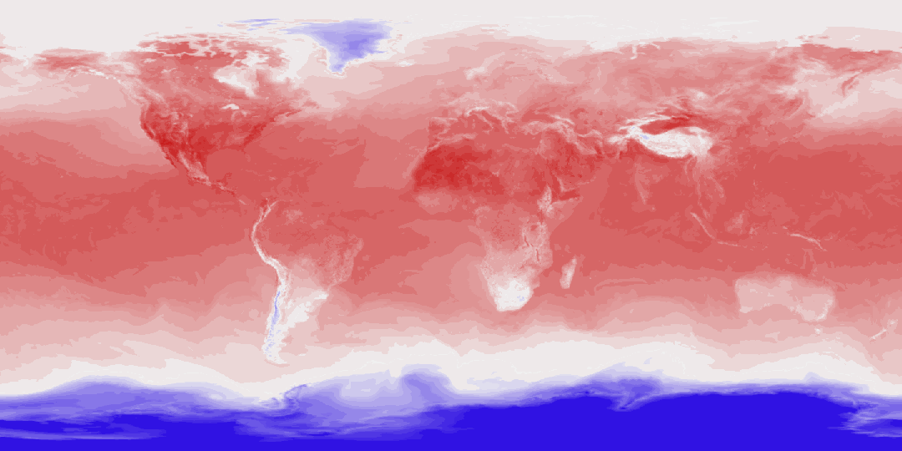
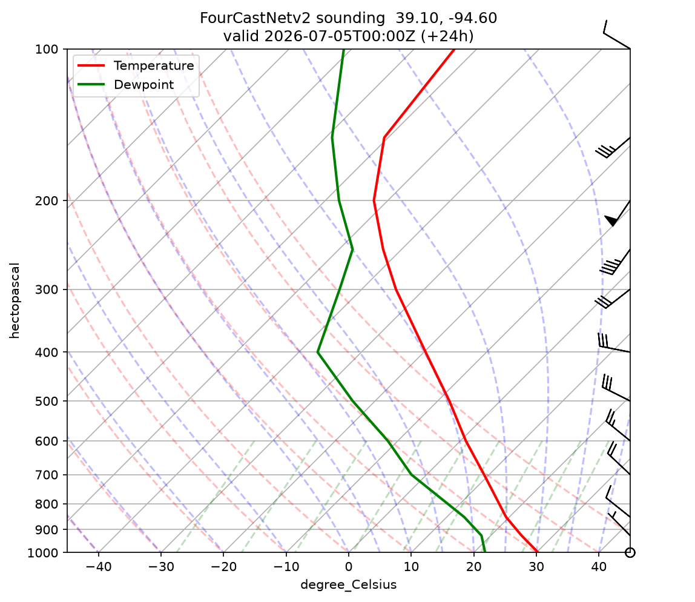

# Local AI Weather Forecasting with QGIS

Generate real multi-day weather forecasts on your own machine with a pretrained
AI model (FourCastNetv2-small via [ECMWF ai-models](https://github.com/ecmwf-lab/ai-models)),
then visualize them as animated maps in QGIS.



## Pipeline

```
ERA5 initial state (Copernicus CDS)
  → FourCastNetv2-small inference on GPU (~2 min for 6 days on an RTX 4050)
  → forecast GRIB (73 variables, 13 pressure levels)
  → per-timestep GeoTIFFs (2m temp, 10m wind speed, MSL pressure)
  → QGIS project with time-enabled layers (Temporal Controller animation)
  → GIF export + Skew-T soundings at any point
```

## Setup

1. Install [QGIS LTR](https://qgis.org) and [Miniconda](https://docs.conda.io/en/latest/miniconda.html)
2. `conda env create -f environment.yml`
3. Install CUDA PyTorch: `conda run -n weather pip install torch --index-url https://download.pytorch.org/whl/cu128`
   and `conda run -n weather pip install onnxruntime-gpu`
4. Create a free [Copernicus CDS](https://cds.climate.copernicus.eu) account and put your
   key in `~/.cdsapirc`:
   ```
   url: https://cds.climate.copernicus.eu/api
   key: <your-uuid-key>
   ```
5. Verify: `conda run -n weather python scripts/check_gpu.py`

**Known issue:** with PyTorch ≥ 2.6 the FourCastNetv2 checkpoint fails to load
(`weights_only` default change). Patch `ai_models_fourcastnetv2/model.py` in your
env to pass `weights_only=False` to `torch.load` — the checkpoint comes from
ECMWF's official asset store.

## Run a forecast

```powershell
.\run_forecast.ps1                       # latest available ERA5, 6-day forecast
.\run_forecast.ps1 -Date 20260704 -LeadTime 240
```

Open `qgis/weather_forecast.qgz`, enable a variable group, open the Temporal
Controller, and press play.

## Skew-T soundings

```powershell
conda run -n weather python scripts/skewt_at_point.py data/forecasts/<run>.grib --lat 39.1 --lon -94.6 --step 24
```



## Scripts

| Script | Purpose |
|---|---|
| `check_gpu.py` | Verify env: CUDA torch, ONNX-GPU, ecCodes, cfgrib, cdsapi |
| `grib_to_geotiff.py` | Forecast GRIB → time-stamped GeoTIFFs (`--var 2t\|wind\|msl\|...`) |
| `build_qgis_project.py` | Create the base QGIS project |
| `add_forecast_layers.py` | Load GeoTIFF series as time-enabled, styled layers |
| `export_animation.py` | Render the series to an animated GIF |
| `skewt_at_point.py` | Skew-T log-P sounding at any lat/lon and forecast hour |

Forecast data (GRIB/GeoTIFF) is not committed — regenerate with `run_forecast.ps1`.
